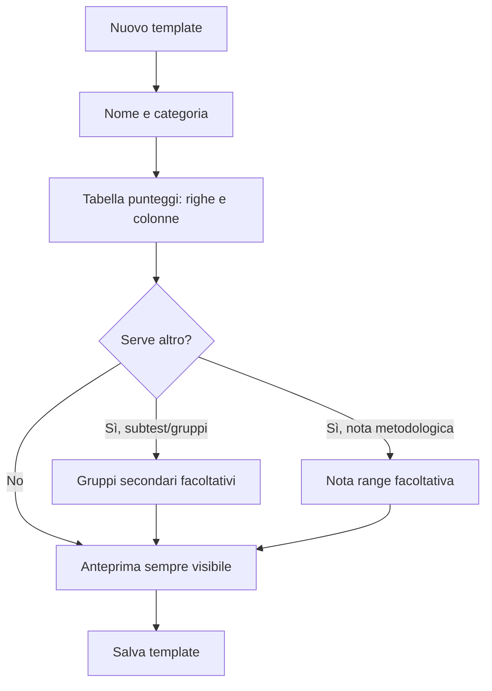

# Piano UX/UI — Gestione Test

**Perimetro**: `src/components/pages/GestioneTest.tsx` + `src/components/state/gestioneTestState.ts` (creazione/modifica dei `TestTemplate` che alimentano wizard, tabelle e narrativa Gemini).

**Obiettivo**: oggi la pagina presuppone che chi la usa capisca concetti da programmatore (chiave/slug, espressioni con `{parentesi}`, "colonna" come termine di modello dati). L'utente reale è una neuropsicologa, non una programmatrice, che userà questa schermata saltuariamente (quando serve aggiungere o correggere un test) da PC e da smartphone. Il piano non tocca il motore di calcolo (`testTemplateEngine.ts`) né lo schema Zod (`core/testTemplate.ts`): sono corretti, il problema è tutto nel modo in cui l'interfaccia li espone.

**Metodo seguito**: lettura integrale di `GestioneTest.tsx` e `gestioneTestState.ts`, di `core/testTemplate.ts` e `services/testTemplateEngine.ts`, del README (§4, §6, §10), della skill `psicorelazioni-dev` e di `references/struttura-dati.md`, oltre ai design token in `src/styles/index.css`. Nessun codice è stato modificato: questo documento è solo il piano.

---

## 1. Diagnosi — dove l'interfaccia presuppone competenze tecniche

### 1.1 Terminologia da programmatore mostrata direttamente all'utente
In `PannelloCampo` il campo si chiama letteralmente **"Chiave (slug auto)"**, mostrato in monospace, editabile liberamente — subito sotto "Etichetta \*". Un'etichetta e una "chiave" sembrano due informazioni che l'utente deve fornire entrambe, ma la chiave è un dettaglio implementativo (identifica il campo per le formule e per il salvataggio). Lo stesso accade per i sottotest nei gruppi secondari (`c.key` in `UPDATE_CAMPO_GRUPPO`). Nessuna psicologa saprà cosa significa "slug", né perché debba importarle.

### 1.2 Un bug silenzioso travestito da funzionalità
In `gestioneTestState.ts`, l'azione `UPDATE_CAMPO` rigenera la chiave da zero a ogni tasto digitato nell'etichetta:
```ts
const updated = { ...c, [action.payload.field]: action.payload.value }
if (action.payload.field === 'label') updated.key = toSlug(action.payload.value)
```
Se quella riga è già referenziata da una formula altrove (es. un "Totale" che somma `{icv}`), correggere anche solo un refuso nell'etichetta cambia silenziosamente la chiave e rompe il riferimento — senza alcun avviso. È il "Limite noto" già documentato in README §6, ma lì è descritto come limite accettato; per un'utente non tecnica è un modo per rompere un calcolo senza nessun segnale, nel mezzo di una modifica che sembra innocua ("ho solo corretto un errore di battitura").

### 1.3 Interazione a griglia poco scopribile
`GrigliaTemplate` usa intestazioni di riga/colonna cliccabili per aprire un pannello di configurazione sotto la griglia (`PannelloColonna`/`PannelloCampo`). È un pattern efficiente ma non standard: non c'è alcun indizio visivo (a parte il cursore) che una cella di intestazione sia cliccabile, né un suggerimento la prima volta che si apre la pagina. Su smartphone, dove l'hover non esiste, l'unico modo per scoprirlo è tentare di toccare.

### 1.4 Validazione posticipata e generica
`validate()` dentro `FormTemplate` restituisce **un'unica stringa** (il primo errore trovato) mostrata in fondo al form solo al momento di "Salva template". La skill di progetto stessa richiama, per il wizard, la convenzione opposta ("mai accumulata alla fine... messaggio inline su cosa manca"): qui non viene seguita. Un'utente che dimentica un nome colonna su 6 righe compilate deve leggere un messaggio generico, tornare a cercare quale riga/colonna è incompleta e ripetere il salvataggio a tentativi.

### 1.5 Troppe azioni per ogni template (sovraccarico di scelta)
Ogni `TemplateCard` mostra fino a 6 pulsanti appiancati (Dettagli, Modifica, Duplica, Rendi predefinito/Rimuovi da predefiniti, Disattiva, Elimina). Per un uso saltuario, la scelta "quale pulsante premo" è essa stessa un ostacolo, e "Disattiva" vs "Elimina" non spiega, lì per lì, che solo il secondo è irreversibile (lo spiega solo dopo, nel dialogo di conferma).

### 1.6 Foglio bianco: nessun punto di partenza guidato
Creare un template da zero parte da `INIT_FORM`: un solo campo vuoto, una colonna "Punteggio", scala "scalare" di default. Chi non ha familiarità con la struttura (righe × colonne, scala, gruppi secondari) affronta una pagina vuota senza sapere da dove cominciare, a meno di passare dai due flussi assistiti da AI ("Estrai da Profilo" / suggerimenti). Manca un punto di mezzo per chi vuole creare un test manualmente ma senza partire dal vuoto assoluto.

### 1.7 Anteprima nascosta per scelta
`showPreview` parte `false`: l'anteprima (tabella + narrativa d'esempio) richiede un clic consapevole su "Mostra anteprima". Per chi non naviga a vista nella struttura dati, l'anteprima è lo strumento principale per capire "cosa sto costruendo" — nasconderla per default va nella direzione sbagliata (si scopre tardi un problema di forma, non subito).

### 1.8 Mobile: la griglia non si adatta
`GrigliaTemplate` usa una CSS grid con colonne a larghezza fissa in pixel (`colW = 108`, `labelW = 168`) e scroll orizzontale. Il resto dell'app ha un breakpoint mobile dedicato (`@media (max-width: 700px)` in `src/styles/index.css`, usato per `.meta-row`, `.stats-row`, sidebar a drawer), ma la griglia dei template non ha alcun adattamento: su schermo stretto diventa una tabella in scroll orizzontale con bottoni piccoli, poco adatta al tocco.

---

## 2. Principi guida per il redesign

1. **Linguaggio clinico, non di modello dati**: mostrare solo i termini di cui l'utente ha davvero bisogno (etichetta, punteggio, fascia); nascondere dettagli interni (chiave/slug) dietro un livello "avanzate", non nel flusso principale.
2. **Prevenire l'errore, non solo segnalarlo**: se un'azione può rompere qualcosa altrove (rinominare una riga usata in una formula), va impedita o confermata esplicitamente al momento, non scoperta dopo.
3. **Mostrare, non spiegare**: l'anteprima è lo strumento primario di comprensione, va tenuta visibile di default, non opt-in.
4. **Divulgazione progressiva**: le opzioni facoltative/avanzate (gruppi secondari, nota range, chiave manuale) restano disponibili ma collassate; il percorso minimo per un test semplice deve restare breve.
5. **Un'azione primaria per contesto**: ridurre la scelta visibile per azione (menu overflow per le azioni meno frequenti sulla card).
6. **Stessa coerenza del resto dell'app**: validazione inline per campo (come nel wizard), stessi componenti/token CSS esistenti (`.card`, `.btn`, `.form-input`, `.alert`), niente nuove dipendenze/librerie UI (il progetto è CSS puro, senza Tailwind/shadcn — vedi README §1).
7. **Mobile è un caso d'uso reale**, non un ripiego: ogni nuova interazione va verificata anche sotto i 700px.

---

## 3. Piano a fasi

### Fase 0 — Validazione leggera con l'utente reale (facoltativa, consigliata prima della Fase 3+)
Essendo un'app a utente singola, prima di investire nelle fasi strutturali (3–5) vale la pena osservare 10-15 minuti la psicologa mentre prova a creare un template da zero sull'interfaccia attuale (o su un primo mock della Fase 1), senza guidarla. Serve a confermare quali dei problemi §1 sono realmente quelli che la bloccano, prima di ridisegnare il flusso di creazione.

### Fase 1 — Quick win a basso rischio (solo copy e piccole modifiche JSX, nessun cambio di stato/dati)
**File coinvolti**: `GestioneTest.tsx` (nessuna modifica a `gestioneTestState.ts`).

- Anteprima aperta di default (`showPreview: false` → `true` nell'inizializzazione del reducer in `FormTemplate`), o almeno di default aperta in creazione di un nuovo template.
- Aggiungere un breve suggerimento sopra `GrigliaTemplate` la prima volta che il form è vuoto (es. "Tocca una riga o una colonna per configurarla"), riusando lo stesso stile del testo d'aiuto già presente sotto il titolo "Tabella dei punteggi".
- Consolidare le azioni meno frequenti della `TemplateCard` (Duplica, Rendi/Rimuovi predefinito, Elimina) in un menu "···" a comparsa, lasciando visibili solo Dettagli e Modifica come azioni primarie. Riduce da 6 a 2-3 pulsanti sempre visibili.
- Copy dei due pulsanti pericolosi più esplicita: "Disattiva (puoi riattivarlo)" vs "Elimina per sempre"; stessa distinzione rinforzata nei due dialoghi di conferma già esistenti (`confirmDisattiva`/`confirmDelete`).
- Rinominare l'etichetta "Chiave (slug auto)" solo come micro-copy (in attesa della Fase 2 che la nasconde davvero) in qualcosa che non usi la parola "slug", es. "Identificativo interno (generato automaticamente)".

**Rischio**: minimo, nessuna modifica allo stato o al salvataggio.

### Fase 2 — Prevenire invece di segnalare dopo: chiave/slug e formule
**File coinvolti**: `gestioneTestState.ts` (logica reducer), `GestioneTest.tsx` (UI di avviso e validazione inline).

- **Blocco della rigenerazione automatica della chiave**: in `UPDATE_CAMPO` (e nell'equivalente `UPDATE_CAMPO_GRUPPO`), derivare `key` da `toSlug(label)` solo finché la riga non ha ancora una chiave "confermata" (es. finché è vuota o coincide ancora con lo slug dell'etichetta precedente); una volta che la chiave esiste ed è referenziata da almeno una formula di un'altra riga (verificabile scorrendo `campiPrincipali` per `formula.parti`/`espressioneAvanzata`), l'etichetta si può continuare a modificare liberamente ma la chiave resta ferma.
- Se l'utente prova comunque a cambiare manualmente la chiave (nel pannello "avanzate" della Fase successiva) di una riga già usata in una formula altrove, mostrare un avviso inline non bloccante: "Questa riga è usata nella formula di **Totale**: cambiando l'identificativo, quel calcolo smetterà di funzionare finché non lo aggiorni tu."
- **Validazione per campo invece che aggregata**: sostituire l'unico messaggio di `validate()` mostrato solo al salvataggio con indicatori inline sui campi incompleti (bordo/messaggio sotto la riga o la colonna specifica in `PannelloCampo`/`PannelloColonna`, badge "manca il nome" sull'intestazione nella griglia). Il controllo aggregato di `validate()` può restare come rete di sicurezza finale prima del salvataggio, ma non deve essere la prima né unica fonte di feedback.

**Rischio**: medio — tocca il reducer, va accompagnato da un aggiornamento/aggiunta di test mirati (vedi §5).

### Fase 3 — Divulgazione progressiva del form
**File coinvolti**: `GestioneTest.tsx` (ristrutturazione JSX di `FormTemplate`), eventuali nuove classi in `src/styles/index.css`.

Riorganizzare `FormTemplate` in sezioni con peso visivo diverso, invece di un'unica schermata lunga e piatta:

- **Sempre aperte** (percorso minimo per un test semplice): Nome e categoria → Tabella dei punteggi (griglia) → Anteprima.
- **Collassate di default** (facoltative, riusando il pattern `<details>` già usato per i gruppi secondari): Gruppi secondari/subtest, Nota range, opzioni "Richiede età/strumenti".
- La chiave manuale di riga/colonna (dalla Fase 2) va dentro un collassabile "Impostazioni avanzate" all'interno di `PannelloCampo`, non visibile di default.



**Rischio**: medio — è un refactor del rendering, ma senza toccare la forma dei dati salvati (`TestTemplate` invariato).

### Fase 4 — Punto di partenza guidato per nuovi template
**File coinvolti**: `gestioneTestState.ts` (nuove costanti di preset), `GestioneTest.tsx` (piccolo step iniziale prima di `INIT_FORM`).

Prima di mostrare il form vuoto, proporre 2-3 pattern di partenza comuni (solo pre-compilazione lato client di `FormState`, nessuna chiamata Gemini, nessuna modifica allo schema):
- "Un solo punteggio principale" (es. test con un unico indice + fascia)
- "Più punteggi/subtest" (griglia con 3-4 righe già pronte da rinominare)
- "Questionario con più scale" (pensato per pattern tipo CBCL: più righe, eventuale gruppo secondario già abbozzato)

Ognuno resta comunque completamente modificabile: sono solo valori iniziali diversi per `campiPrincipali`/`colonne`/`gruppiSecondari` di `INIT_FORM`, non un vincolo. Va mantenuto ben visibile anche il percorso già esistente "Estrai da Profilo"/suggerimenti AI come alternativa preferenziale quando applicabile.

**Rischio**: basso — additivo, non cambia il comportamento per chi già modifica un template esistente (`templateToForm()` resta il punto di ingresso per l'edit, invariato).

### Fase 5 — Griglia più leggibile e adatta al tocco
**File coinvolti**: `GestioneTest.tsx` (`GrigliaTemplate`), `src/styles/index.css` (eventuali nuove classi al posto di stili inline per gestire il breakpoint).

- Alzare l'area di tocco delle intestazioni riga/colonna (min. ~44px di altezza) e aggiungere un'icona persistente (es. una matita) accanto al testo, non solo affidarsi al cursore per segnalare che sono cliccabili.
- Sotto il breakpoint mobile già esistente (`max-width: 700px`), sostituire la griglia con scroll orizzontale con una vista a elenco verticale (una card per riga, con le colonne mostrate come coppie etichetta/valore impilate) — coerente con l'adattamento già fatto altrove nello stesso file CSS per `.meta-row`.
- Aggiungere `aria-label` espliciti sui pulsanti icona-soltanto della griglia (Aggiungi riga/colonna), non solo `title` (che su touch non è mai visibile).

**Rischio**: medio — tocca un componente centrale della pagina, va verificato visivamente su desktop e viewport stretto.

### Fase 6 — Editor formule in linguaggio naturale
**File coinvolti**: `GestioneTest.tsx` (`PannelloCampo`), nessuna modifica a `testTemplateEngine.ts` (l'espressione salvata resta invariata, `{chiave}` compreso).

- Sotto il campo "Espressione" in modalità avanzata, mostrare una riga di sola lettura che traduce le chiavi nelle rispettive etichette in tempo reale, es. da `({icv} + {irp}) / 2` a "= (Comprensione Verbale (ICV) + Ragionamento Percettivo (IRP)) ÷ 2". È una trasformazione puramente di visualizzazione (risolvere ogni `{key}` nel `label` del campo corrispondente), la stringa salvata in `FormulaCalcolo.espressione` non cambia.
- Le modalità "Somma"/"Media" (già basate su checkbox di etichette, non su testo libero) restano il percorso consigliato di default; "Avanzata" va presentata esplicitamente come opzione per chi ha già capito il meccanismo, non come prima scelta.

**Rischio**: basso — additivo e isolato a un sotto-componente.

---

## 4. Vincoli da rispettare durante l'implementazione

- **Nessuna modifica allo schema Zod** (`core/testTemplate.ts`) né alle colonne Supabase: tutto il piano è realizzabile a livello di componente/reducer client-side.
- **CSS puro**, niente Tailwind/shadcn/libreria di componenti (vedi README §1): eventuali nuove classi vanno in `src/styles/index.css`, riusando le variabili esistenti (`--accent`, `--radius`, `--text-muted`, …).
- **`useReducer`, non `useState` sparsi**: le modifiche alla Fase 2/3 restano dentro `formTemplateReducer`/`gestioneTestReducer` esistenti, senza introdurre stato parallelo.
- **Modalità mock**: nessuna di queste modifiche introduce nuove chiamate a Supabase/Gemini, quindi non serve alcun nuovo ramo `USE_MOCK`/`USE_MOCK_AI`.
- **`buildGeminiPayload()` non va toccato**: tutte le modifiche sono a monte (come l'utente compila il template), non nel modo in cui i dati arrivano a Gemini.

## 5. Come verificare che ha funzionato

- **Compiti d'uso**: verificare che una persona senza contesto tecnico riesca a (a) creare un test con un solo punteggio e una fascia personalizzata, (b) aggiungere una riga "Totale" calcolata come somma di altre due, (c) capire senza spiegazioni la differenza tra "Disattiva" ed "Elimina", tutto senza mai leggere le parole "chiave"/"slug"/"espressione" a meno di aprire volontariamente le impostazioni avanzate.
- **Rientrata la Fase 2**: aggiungere un test in `core/testTemplate.test.ts` o un nuovo test del reducer che verifichi che rinominare l'etichetta di una riga già referenziata da una formula **non** cambi silenziosamente la sua chiave.
- **Dopo ogni fase**: `npx vitest run`, `npx tsc -b`, `npm run lint` (repo convention, README §10), oltre a una verifica manuale in modalità mock (`npm run dev` senza `.env.local`) sia a larghezza desktop sia sotto i 700px.

## 6. Cosa non fare

- Non trasformare "Gestione Test" in un wizard multi-step rigido come `WizardNuovaRelazione`: qui l'utente deve poter tornare liberamente su qualsiasi sezione di un template esistente, non seguire un percorso lineare obbligato.
- Non nascondere la chiave/slug così a fondo da renderla irraggiungibile: resta necessaria per casi limite (rinominare davvero un identificativo, risolvere un conflitto), va solo tolta dal percorso principale.
- Non introdurre una libreria di componenti UI esterna per risolvere i problemi di scopribilità: i pattern esistenti (`<details>`, pannelli sotto la griglia, badge) sono sufficienti se rifiniti.
